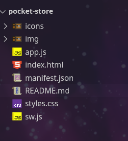
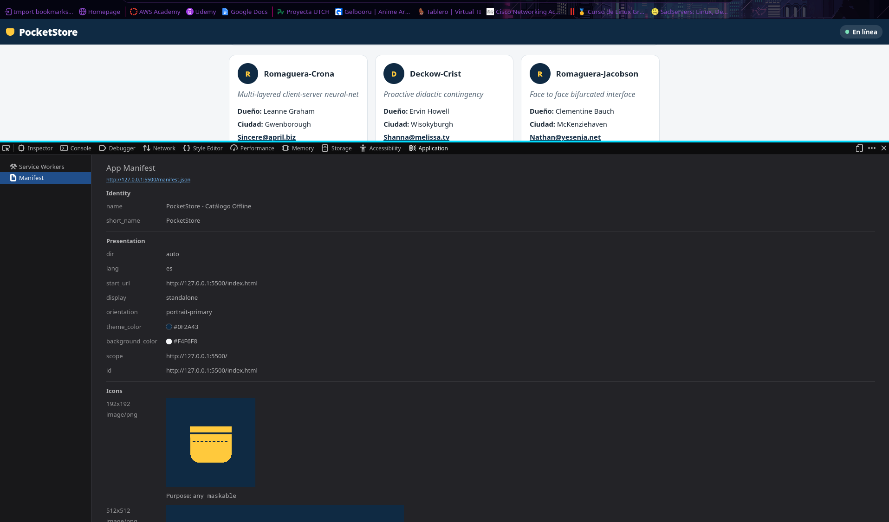
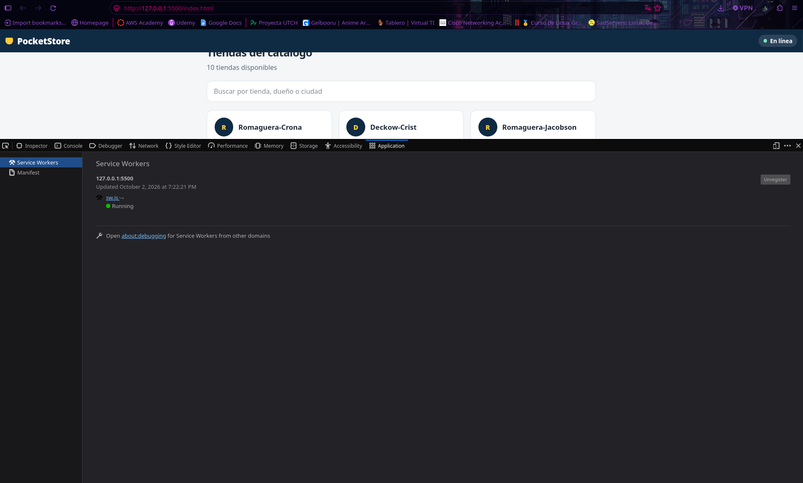
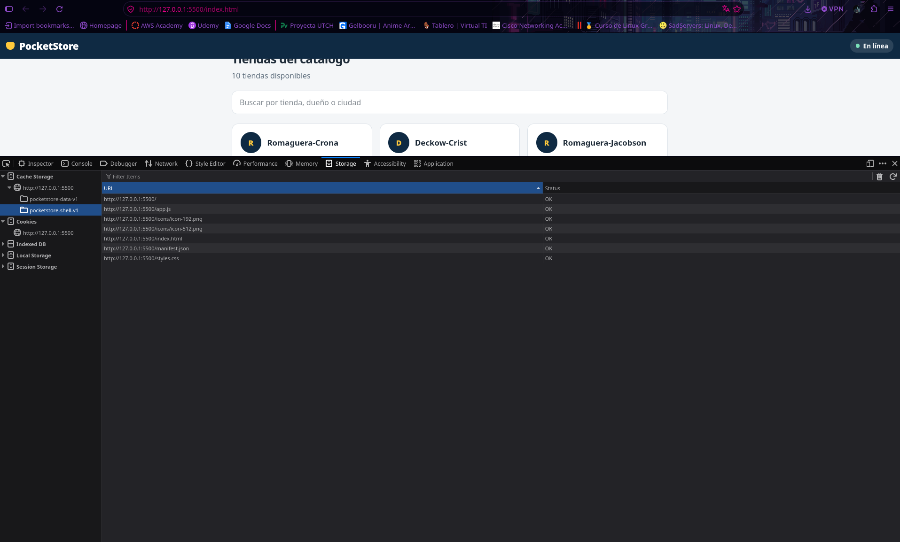
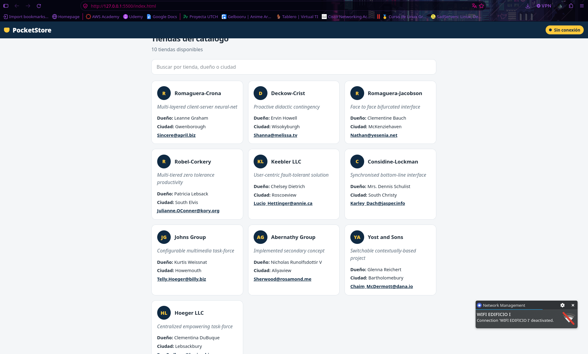
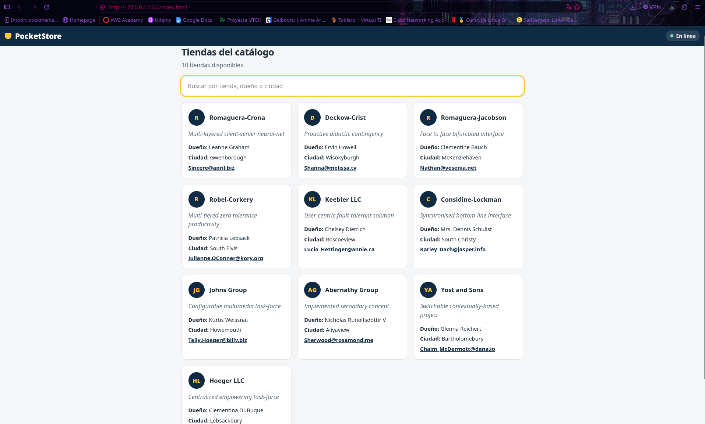

# PocketStore: Catálogo Offline con Vanilla JS

Aplicación web de una sola página (PWA) que lista tiendas obtenidas de una API pública y **funciona sin conexión a internet**. Está hecha con HTML, CSS y JavaScript puro, sin frameworks.

- **Autor:** Jesús Arturo Castilla González
- **Modalidad:** desarrollo individual en clase
- **Demo:** https://github.com/Asterion-J/pocket-store.git

## Características

- App Shell (barra superior, contenido y pie de página) que carga al instante.
- Manifiesto web para instalar la app en el dispositivo (`display: standalone`).
- Service Worker con caché para uso sin conexión.
- Datos dinámicos desde [JSONPlaceholder](https://jsonplaceholder.typicode.com/users).
- Indicador de estado de conexión y buscador.

## Estructura del proyecto

```
/pocket-store
├── index.html      # Vista (App Shell)
├── styles.css      # Estilos del App Shell
├── app.js          # Lógica de la app y registro del SW
├── sw.js           # Service Worker y caché
├── manifest.json   # Manifiesto de instalación
├── icons/          # Iconos 192x192 y 512x512
└── img/            # Capturas del proceso de desarrollo
```

## Cómo ejecutarlo

Los Service Workers solo funcionan en `localhost` o HTTPS, por lo que no basta con abrir el archivo con doble clic.

```bash
cd pocket-store
python -m http.server 8080
```

Abre `http://localhost:8080` en Firefox(Muerte a chrome y opera). También sirve la extensión Live Server de VS Code.

## Cómo funciona

### 1. Manifiesto (`manifest.json`)
Define `name`, `short_name`, `start_url`, `display: "standalone"`, los colores (`#0F2A43` y `#F4F6F8`) y dos iconos (192x192 y 512x512).

### 2. App Shell (`index.html` y `styles.css`)
Estructura fija con header, main y footer. Mientras llegan los datos se muestran tarjetas "esqueleto", así la interfaz aparece de inmediato.

### 3. Service Worker (`sw.js`)
| Evento | Qué hace |
|--------|----------|
| `install` | Guarda en caché los archivos del App Shell. |
| `activate` | Elimina cachés de versiones anteriores. |
| `fetch` | App Shell: **cache-first**. API: **network-first** con respaldo en caché. |

### 4. Contenido dinámico (`app.js`)
Hace `fetch()` a `https://jsonplaceholder.typicode.com/users` y muestra cada usuario como una tienda (empresa, eslogan, dueño, ciudad y correo). Si no hay red, el Service Worker entrega la última respuesta guardada.

## Cómo probar el modo offline

1. Abre la app con internet y recarga una vez para que el Service Worker guarde todo.
2. En DevTools abre **Application > Service Workers** y marca **Offline**.
3. Recarga la página: el catálogo sigue apareciendo.

## Proceso de desarrollo

### Estructura de archivos 


### Manifiesto detectado por DevTools


### Service Worker activo


### Caché guardada


### App funcionando sin conexión


### App instalada


## Tecnologías

HTML5, CSS3, JavaScript (ES6+), Service Workers, Cache API, Web App Manifest.
